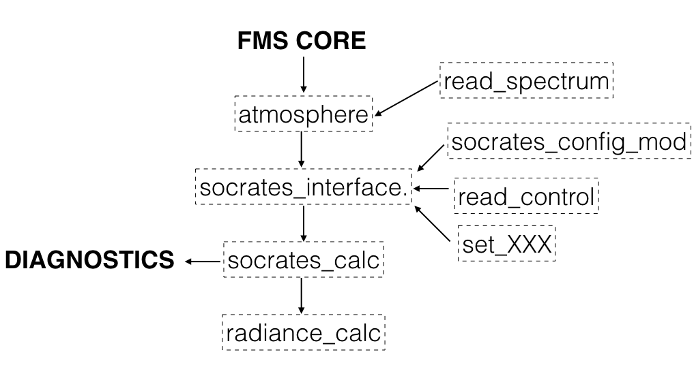

# ExoFMS Socrates Documentation

This is the documentation for the [ExoFms-Socrates code](https://github.com/mark-hammond/ExoFMS-Socrates), which couple the Socrates radiative transfer module to the Exo-FMS GCM.

This repo and documentation also contains instructions for setting up and running any GCM test with Socrates, using HITRAN, HITEMP, or ExoMol data. 

Also see how to use Socrates in [ROCKE-3D](https://simplex.giss.nasa.gov/gcm/ROCKE-3D/UserGuidetoSOCRATES_PlanetRadiation_inROCKE3D.html), related [tools](https://github.com/DavidSAmundsen/socrates_tools), and the (password-protected) (Socrates repository)[https://code.metoffice.gov.uk/trac/socrates].

## Installation

1. Install Socrates following the instructions at the (Socrates repository)[https://code.metoffice.gov.uk/trac/socrates].

2. Copy the contents of the "bin" folder to the "srcmods" folder of your experiment

3. Use the "socrates_interface" module to interact with Socrates.

## Usage

The "socrates_interface" function takes the arguments:

```
CALL socrates_interface(Time, rlat, rlon,     &
     tg_tmp, t_surf, p_full, p_half, n_profile, n_layer,     &
     output_heating_rate, net_surf_sw_down, surf_lw_down, fms_stellar_flux )
```

where the last row is the output.

Diagnostics such as band-averaged fluxes are dealt with inside the interface module.

## Structure

Socrates + ExoFMS has the following structure:



The intention is that a normal user can change the parameters of their test (longwave spectral file, shortwave spectral file, stellar flux, and Socrates options) without going below the interface level.

More to be added on using clouds etc.

## Examples

Earth-like atmosphere

55 Cancri e CO/CO2 atmosphere

Cloudy pure H2O atmosphere
